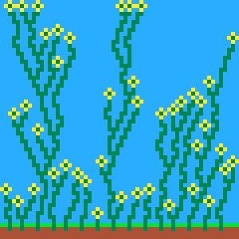
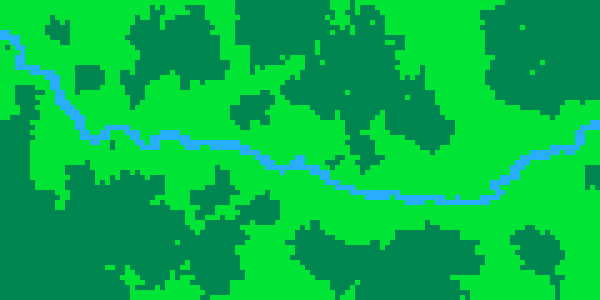

# MarkovJuniorPy

## This is my own implemention of PCG generation based on markov algorithm heavily inspired by the MarkovJunior https://github.com/mxgmn/MarkovJunior.
--------------------------------------------------------------------------------------------------------

 

Rules, Rule Sets and Grammar
----------------------------
A grammar consists of rules and/or rulesets. Rules may have mutliple input and output pairs.
When a rule with multiple pairs is called one of the rule pairs is returned randomly 
A rule set is a defined container of rules.We have markov and sequence as rule set types. 
Markov rule sets utilize markov algorithm whereas sequences by default run all the rules once. 
Rule sets can include each other.

Context, Environment and Seed
-----------------------------
A context has an environment where a grammar is applied with a seed. 

Syntax
----------------------------

The context must have a seed for random number generator and shuffle_matches must be 1 or 0. When enabled, shuffle_matches makes shuffling of candidate matches to be replaced for a given input pattern. The environment path represents the canvas where the result ASCII image will be created. Alphabet is not parsed by the interpretor and thus optional but creates a space to define patterns for reading.

    <context seed="11" shuffle_matches="0">
        <environment path="../contexts/boxes_env.txt" />
        <alphabet>
            <symbol pattern="*G*/GgG/*G*" />
            <symbol pattern="*Y*/YgY/*Y*" />
            <canvas colors="U" />
        </alphabet>
    </context>

A basic rule pair consists of in and out pair and an optional rot parameter. Rot parameter rotates in and out parameters n times 90 degrees in clockwise or counterclockwise when n is a negative number.

    <rule in="B/E" out="E/G" rot="2"/>

    <rule in="B/E" out="E/G" /> is same as <rule in="B/E" out="E/G" rot="0"/>

The following shows string formatting for inputs and outputs.

    UUU/UUU/UPU 

    is equal to

    UUU
    UUU
    UPU

There are 3 basic rule types, like the MarkovJunior one, all and prl. 
Rules, one all and prl can contain mutliple input and output pairs. By default,
all these input and output pairs will be iterated top down and apllied and the success
variable of the last applied rule will be returned, with the parameter random=1 random selection is enabled and
only one random input and output pair will be applied.

Random Rule Selection

    <all random="1"> 
        <rule in="B/E" out="E/G" />
        <rule in="T" out="U" />
    </all>

Rule Iteration

    <all random="0">  or  <all> 
        <rule in="B" out="G" />
        <rule in="T" out="U" />
    </all>

Rulesets markov and sequence have the top down hiearchy. A sequence can be applied many times by using the parameter loop. Rule sets can be nested in each other and will act as a normal rule, e.g. in a markov where two sequences exist the markov will break at the moment the both sequences can not execute any more rule.

Looping of Sequence

    <sequence loop="53"> 
        <one>
            <rule in="B" out="E" />
        </one>
    </sequence>

Normal Sequence 

    <sequence> or <sequence loop="1">
        <one>
            <rule in="B" out="E" />
        </one>
    </sequence>

Markov Algorithm

    <markov> 
        <one>
            <rule in="B" out="E" />
        </one>
    </markov>

Ruleset Nesting

    <markov>
        <sequence>
            <one>
                <rule in="UUU/UUU/UUU" out="*P*/PbP/*P*" />
            </one>
        </sequence>
        <one>
            <rule in="UUU/UUU/UUU" out="*Y*/YgY/*Y*" />
        </one>
        <sequence>
            <one>
                <rule in="UUU/UUU/UUU" out="*P*/PbP/*P*" />
            </one>
        </sequence>
    </markov>

Syntax example

    <context seed="21" shuffle_matches="0"> 
        <environment path="../contexts/boxes_env.txt" />
        <alphabet>
            <symbol pattern="*G*/GgG/*G*" />
            <symbol pattern="*Y*/YgY/*Y*" />
            <canvas colors="U" />
        </alphabet>
        <grammar>
            <markov>
                <sequence>
                    <one>
                        <rule in="UUU/UUU/UUU" out="*P*/PbP/*P*" />
                    </one>
                    <one>
                        <rule in="UUU/UUU/UUU" out="*Y*/YgY/*Y*" />
                    </one>
                </sequence>
            </markov>
        </grammar>
    </context>

This produces the following output:

Dependencies 
------------

Recommended Python Version
    Python 3.10.10

Used Libraries

    numba==0.56.4
    numpy==1.23.5
    opencv_python==4.7.0.72
    Pillow==9.5.0

Usage
-----

This will execute the grammar to the enviroment defined in the .xml file. Note that environment must be generated before.

    python3 Main.py <path/to/grammar.xml>